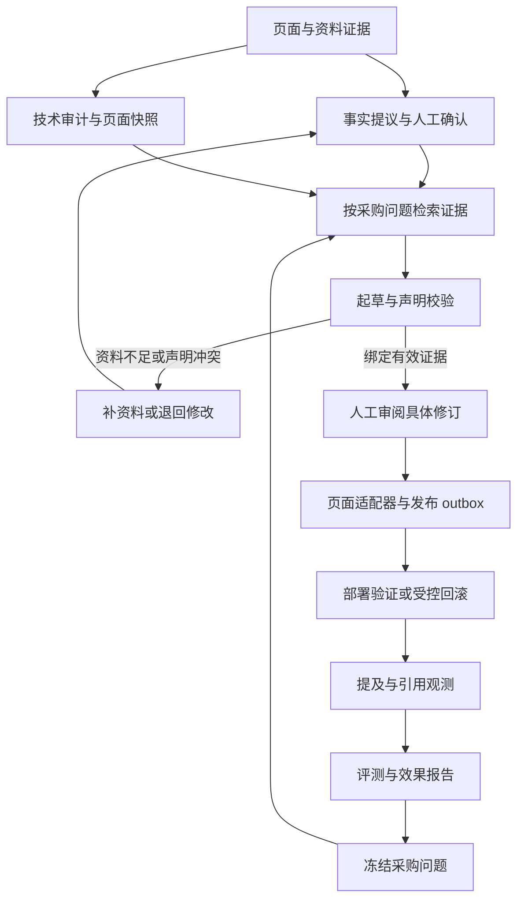

**trade-site-audit-content-agent 项目优化目标**

版本：1.0；编制日期：2026-10-01。对象：[Adrian-lzr/trade-site-audit-content-agent](https://github.com/Adrian-lzr/trade-site-audit-content-agent)。分析基线：[2356fa39898d1495bdbd95ae65a03486f197d70a](https://github.com/Adrian-lzr/trade-site-audit-content-agent/commit/2356fa39898d1495bdbd95ae65a03486f197d70a)，本次已重新核对 main，未发现后续提交。

本文件定义优化后的产品、交付结果和验收目标。配套《AI项目优化执行计划书_20261001.md》定义执行顺序、代码范围和检查方法。两份文件应一起交给执行 AI；本文件不要求更换现有技术栈。

**1. 最终定位与主要目标**

将项目建设为“面向 B2B 外贸独立站的事实约束内容治理与可见性观测工作台”：从网页证据和已确认企业事实出发，围绕采购问题生成可追溯改稿，由人工审阅具体修订，再把改稿应用到受控网站，保留部署与回滚证据，并按冻结的采购问题持续观测回答中的品牌提及和网站引用。

主要用户为网站负责人、事实审核人员和内容运营人员。首个交付场景以一个工作区、一个受控网站、一类 B2B 产品为单位，先把端到端闭环做实，再扩大站点、市场和产品范围。现有阀门合成资料可用于演示；其企业资质、型号和参数必须继续标识为合成资料。

核心价值是提高内容事实可信度、减少人工核对和交付摩擦、提供可复核的观测数据。搜索排名、AI 引用增长和询盘增长属于待验证业务结果，不能由本计划预先承诺。

**2. 已有能力与必须解决的基线问题**

现有 FastAPI + SQLAlchemy + LangGraph + React 架构可以保留。已经具备页面快照、企业事实、冻结采购问题、内容修订、人工审批、任务租约、发布 outbox 和可见性采样等基础。本次目标来自源码、原始函数反例及同提交 CI，而不是仅依据 README 功能描述。

| 基线编号 | 已核验的现状 | 对优化目标的影响 |
| --- | --- | --- |
| B01 | 自动校验允许无依据的 FDA 声明、MOQ 数字被改写成压力、嵌套数值漏检 | O01 必须建立声明与事实的对应关系 |
| B02 | 同一事实系列两个有效版本都可能被判为当前；审批未统一检查系列当前版本 | O01 必须统一事实生效与审批失效语义 |
| B03 | 网站域名仅被提及时，当前指标也可能计为网站引用 | O05 必须分离提及、引用和回答覆盖 |
| B04 | 文档标题会混入 body 中 SVG/title 内容 | O02 必须修复解析并保留定位证据 |
| B05 | 发布守卫可能混用 naive / aware datetime；现有探针不是完整 ORM 测试 | O01、O04 必须覆盖 SQLite 与 PostgreSQL 的真实数据库路径 |
| B06 | 发布业务主要写审查 JSON；部署验证主要检查本地 Git commit 存在 | O04 必须修改页面内容并验证页面结果 |
| B07 | Fixture 与通用 HTTP Provider 已有，但未证明真实业务 Provider 和消费者搜索表面接通 | O05 必须提供真实适配器及表面类型说明 |
| B08 | 当前离线评测对“原页面”剥离了本已有的事实，约束方案为模板；无完成的盲评 | O09 必须建立公平输入、真实调用和独立人工评测 |
| B09 | X-Local-User 是身份声明，不能证明身份；前端没有完整登录和工作区流程 | O07 必须接入可验证身份并贯彻工作区隔离 |
| B10 | 内容模型费用未形成统一台账；队列有优先级饥饿风险；容器门禁未等同真实构建 | O08、O10 必须补齐费用、恢复和运行证据 |

证据入口：[内容校验](https://github.com/Adrian-lzr/trade-site-audit-content-agent/blob/2356fa39898d1495bdbd95ae65a03486f197d70a/backend/content_workflow.py#L555)、[事实与路由](https://github.com/Adrian-lzr/trade-site-audit-content-agent/blob/2356fa39898d1495bdbd95ae65a03486f197d70a/backend/app.py#L307)、[可见性指标](https://github.com/Adrian-lzr/trade-site-audit-content-agent/blob/2356fa39898d1495bdbd95ae65a03486f197d70a/backend/visibility_worker.py#L572)、[发布执行](https://github.com/Adrian-lzr/trade-site-audit-content-agent/blob/2356fa39898d1495bdbd95ae65a03486f197d70a/backend/publication_worker.py#L24)、[现有 CI](https://github.com/Adrian-lzr/trade-site-audit-content-agent/actions/runs/36861739882)。同提交 CI 的后端 144 项、评测 7 项和前端构建已通过；这不能替代新增目标的验证。本次未重跑完整依赖环境、PostgreSQL 或 Docker。

**3. 优化后的业务闭环**

模型承担问题驱动的资料检索建议、受约束起草和有限修复。事实确认、审批、发布条件与工作区授权由确定性业务规则执行。采集器原有 robots、网络范围、公共 IP、重定向和响应尺寸限制继续适用于新增路径。

**4. 十项交付目标与验收口径**

以下阈值是拟定的交付目标，不是当前成绩。执行 AI 应先建立可复现测试与数据基线；不能因结果不足而下调阈值或修改测试答案。需要修改目标时，应记录原因和影响，形成可审核变更。

| 目标 | 优化后的能力 | 主要验收标准 | 对应执行任务 |
| --- | --- | --- | --- |
| O01 内容事实可信 | 声明绑定产品、属性、值、单位、范围、事实版本和来源；当前版本策略一致 | 已定义的高风险反例全部阻断或转人工；旧事实替代后旧审批不能发布；支持案例通过；零未审修订可发布 | T01、T03、T04、T08、T11 |
| O02 审计可复核 | 原 HTML、文档元数据、正文、canonical 和规则证据分别保存；采样范围可解释 | SVG 标题反例通过；至少 15 个代表页面片段回归；所有 fail 均可定位规则与证据；同一快照重跑结果稳定 | T02、T10 |
| O03 Agent 可恢复 | 明确生成任务、LangGraph checkpoint、审批和 outbox 各自状态；有限修复与资料不足分支 | 生成→中断→审批→恢复或终结状态一致；拒绝不触发发布；进程重启和重复请求不会多保存修订 | T06、T07、T08、T11 |
| O04 页面真正落地 | 至少一个明确的网站页面适配器；预览、审批、应用、部署验证和回滚贯通 | 实际 title、正文、FAQ 等目标字段改变；原文件不相关内容保留；线上或获授权预发布页面按字段验证；回滚冲突被拒绝 | T12、T13、T17 |
| O05 可见性指标可信 | 品牌提及、域名提及、有效网站引用、问题回答覆盖、采样成功率独立计算 | 提及无 citation 的样本引用率为 0；分母与排除项明确；Provider 类型、时间、市场、问题版本和原始证据可查 | T05、T14、T18 |
| O06 资料检索可追溯 | 采购问题定位企业事实和来源片段；资料导入先形成 proposed 事实 | 至少 CSV 与有文本层 PDF 两类资料入口；来源定位和 hash 可回查；过期、内部、跨工作区事实不能进入公开内容；检索独立测量 | T03、T04、T10 |
| O07 身份与权限有效 | 从受验证身份加载 Membership；登录、工作区选择和审核权限贯通 | 伪造本地身份头不能访问生产模式；过期、错 issuer/audience token 被拒绝；viewer/operator/reviewer/admin 权限和跨工作区回归通过 | T06、T09、T11、T17 |
| O08 任务与费用可运营 | 持久化调用台账、预算预留、结果结算、任务公平领取、恢复和错误分类 | 内容与可见性调用均有 usage/费用来源；未知费用不记为 0；并发预留不超可预留额度；失去租约不得写终态；崩溃窗口有明确处置 | T07、T08、T14、T16、T17 |
| O09 效果可验证 | 真实原页、普通模型改稿、事实约束工作流进行公平比较；独立人工盲评 | 数据分组隔离；30 个 holdout 案例完成三方案盲评；高风险错误单独报告；真实模型成本、时延与质量并列展示 | T15、T18、T19 |
| O10 工程可交付 | 清晰的服务边界、真实运行 CI、自动事件审计、迁移和恢复说明 | 全新环境按文档启动；SQLite 与 PostgreSQL 检查、镜像构建、Worker 实际消费、UI 闭环、备份恢复证据齐全 | T00、T01、T06、T16、T17、T19 |

**O01：事实与声明的具体标准。**

高风险事实包括型号、材料、压力、温度、尺寸、适用标准、认证、食品接触、交期、MOQ、价格和性能保证。为每条事实性声明保存 `fact_id + version + subject + predicate + value + unit + scope + source_locator` 的绑定。结构校验只证明 JSON 合法，不能证明语义正确；语义判断不确定时进入人工复核。

首先覆盖以下反例：无 FDA 证据却声称 FDA approved；MOQ=20 pieces 被写为 pressure=20 bar；20 pieces 被写为 20%；嵌套 JSON 隐含未知参数；同名不同型号参数混用；旧版认证或已经失效事实；把外部 SEO 指南当作企业资质；内部事实或另一工作区事实被公开。断言应同时包含正确写法，防止系统通过“拒绝所有内容”取得高拦截率。

每个事实系列在特定产品与适用范围下只有一个当前可发布版本。未来生效版本不提前替代现行版本；撤销或替代必须留下历史。发布时重新解析当前版本，不能只比较历史行内部的 version。人工批准不能绕过硬性版本、来源与范围冲突。

**O02：采集与审计的具体标准。**

区别 `requested_url`、`final_url`、页面声明的 `canonical_url` 和实际 `<head><title>`。正文抽取不得覆盖原始快照；产品规格表和 FAQ 不能因抽取器偏好文章而被丢弃。新增 sitemap index 支持、受限 URL 发现、可配置查询参数去重和页面类型采样；每次采样报告总数、范围、排除原因及限制。

统一规则结果与 findings 的映射和总计，保留 unknown / needs_review / not_applicable。对 JS 页面使用明确的“需要渲染”状态；如提供浏览器采集插件，只对配置允许的页面启动，采集类型与运行成本单列。Lighthouse 实验室结果与真实用户性能数据分开，不把实验室指标当作现场 Core Web Vitals 证明。

**O03：Agent 状态和人工审核的具体标准。**

采用有限且可解释的工作流：检索→起草→类型与声明校验→最多一次修复→待审核或待资料。审核操作必须绑定修订 hash、事实集合、快照和问题集版本；编辑内容形成新修订并使旧批准失效。

允许的实现是“生成图终结于待审核，审批与发布独立编排”，或“审核后通过 Command(resume) 恢复图”。执行计划默认采用后者并保留数据库审批为权威记录；必须消除当前图状态与业务状态的分歧。发布由 outbox 的确定性消费者执行，恢复图不能直接调用外部发布。

**O04：发布与验证的具体标准。**

必做适配器为受控静态 HTML 页面：页面路径、可编辑字段、目标仓库和映射由服务端配置。使用稳定标记定位正文块，避免让模型生成任意路径或修改整个模板。审查 JSON 可继续保留，页面真实内容必须同步应用。

只有完成真实字段修改的 commit 才能标记为 `applied`。只有目标页面被重新读取、内容和批准修订匹配，才能标记为 `verified`。无法读取、内容不符或部署尚未完成时，显示 pending / mismatch / unavailable。浏览器页面是否与修改后的源文件对应，须绑定部署产物或发布标识；动态页面以稳定目标字段比较，避免整页广告或时间戳使验证误报。

首个真实站点若采用 WordPress，可在基础适配器之后实现 WordPress 草稿适配器。至少一种符合该站点技术形态的适配器完成获授权预发布验证，才算真实试点达标。仅本地 Git commit 和仅合成页面通过属于演示达标。

**O05：观测指标的具体标准。**

| 指标 | 定义与分母 |
| --- | --- |
| 品牌提及率 | 有可信品牌名或已配置别名提及的成功回答数 / 成功回答数 |
| 域名提及率 | 回答中明确提及目标域名的成功回答数 / 成功回答数 |
| 网站引用率 | Provider 返回的 citation 证据中含目标站点有效 URL 的成功回答数 / 成功回答数；域名提及不替代 citation |
| 问题回答覆盖率 | 有独立评定“实际回答采购问题”的成功样本所覆盖的问题数 / 本轮计划问题数 |
| 采样完成率 | 成功样本数 / 本轮计划样本数；与错误、限流、缺权限等状态一起展示 |
| 平均费用与时延 | 在费用可知样本和有时延样本上分别计算，并展示未知数、样本数和排除项 |

一个问题对应重复样本时，问题覆盖与样本比例分别报告；不能把一个问题重复采样五次当成五个问题。引用 URL 做 scheme、域名、端口与边界规范化，避免 `supplier.example.evil.test` 被误判；子域名匹配策略需明确。Provider 原生 citation、手工录入与文本推断引用分别标识可信度。提供了 URL 只证明引用证据存在，不自动证明页面实际支持回答中的全部声明。

观测窗口默认保持同一问题版本、市场、语言、模型或搜索表面、联网设置和重复次数。`model_api`、`consumer_search_surface`、`manual_capture` 不合并成一个成绩；`synthetic` 标记独立于表面类型。首次真实观测建议 10 个问题、每个 3 次，记录波动；模型 API 的结果不代表消费者 ChatGPT 页面或 Google AI Overview 的真实表现。

**O06：检索与资料导入的具体标准。**

先实现工作区、产品、谓词、范围、状态和有效期过滤，再做关键词或全文检索。固定检索测试集建议至少 30 个问题，已知必要事实的 Recall@5 目标 ≥90%，跨工作区与不可公开事实泄漏为 0。该阈值是小样本交付检查，不能代表所有行业或所有自然语言。

企业事实和外部写作指导使用不同数据空间与输出标签。外部指导有获取时间、有效性和来源；知识条目过期时要警示或排除，不能默默继续视为已验证。PDF 无文本层时返回需要 OCR 的明确状态，不能空内容导入成功。向量检索、reranker 和 OCR 是后续扩展；只有现有检索基线显示必要性时才加入，并补独立评测。

**O07：身份与权限的具体标准。**

默认生产身份方案为配置明确 issuer、audience 和 JWKS 的 OIDC / JWT 验证，服务端使用可信 subject 解析 Membership。demo 模式保留本地演示，但页面与配置明确显示 demo；生产模式没有正确身份配置时不能匿名回退。管理员通过受控 CLI 或管理接口管理工作区成员；前端隐藏按钮只改善体验，服务端仍负责权限检查。

完成角色矩阵和资源所有权检查，至少覆盖站点、快照、事实、问题集、修订、审批、发布、采样、证据导出和费用记录。写操作自动记录实际身份、工作区、关联对象、版本、请求或任务 ID；禁止由客户端传入身份字段替代可信身份。

**O08：运行和费用的具体标准。**

内容起草与可见性采用统一调用台账，记录输入 hash、模型与配置、请求/响应标识、重试、tokens、价格版本、费用来源、费用是否已知、时延和错误。API key 与完整敏感资料不进入日志。未知账单信息保持 unknown/null，并影响严格预算模式的准入；不能将 unknown 当免费。

预算预留和调用结果结算使用短事务；HTTP 调用不持有工作区行锁。提供在途预留回收和不确定调用状态的处置。通用 Provider 不一定实现 Idempotency-Key：数据库修订去重与 Provider 计费去重分别描述，未知结果不盲目重试并声称“恰好一次”。

队列至少覆盖两 Worker 同时领取、租约过期恢复、旧 Worker 回写拒绝、连续审计积压下其他任务仍进展。性能门槛固定环境后测量：2 vCPU / 4 GB、PostgreSQL 16、2 Worker、各类 ≥10 个 ≤1 秒的本地 fixture 任务；每类首个任务在 10 秒内开始，全部在 120 秒内完成。读接口压测目标为 20 并发、5 分钟、p95 ≤500 ms、非预期错误率 <1%；不把外部模型和网页请求时延计为本地读接口时延。这些为首版工程目标，真实网络吞吐另报。

**O09：质量评测的具体标准。**

准备至少 50 个案例，建议 20 个 dev、30 个 holdout。按产品系列和来源文档分组隔离，开发集与 holdout 不共享近重复模板；缺资料、单位混淆、版本失效、跨型号和无依据认证均进入测试。

三方案定义：A 为真实原页面的完整有效内容；B 为普通模型改稿；C 为事实约束工作流。B/C 使用相同页面、采购问题、事实资料、模型和输出限制，差异为约束提示、声明验证、有限修复和人工治理；C 的额外修复次数与费用单列。A 的生成费用为 0，但内容评分不能因其没有调用模型而省略。另做移除声明校验或事实版本检查的消融实验，解释增益来源。

holdout 的 30 个案例 × 3 个方案，共 90 份输出盲评。全部输出至少一位独立人工评阅；随机抽取 ≥30 份由第二位复评并记录分歧。执行 AI 可准备材料和辅助整理，不得伪造人工评分、签名或完成率。

首版目标：C 的可发布内容中高风险无依据声明为 0；事实绑定正确率 ≥95%；在资料充足的可回答案例上，采购问题覆盖率 ≥80%，事实性评价 ≥4/5 的输出占比 ≥80%；该组的错误拒绝计为未通过。资料不足、应拒绝的案例单列正确拒绝率；所有案例的可发布、无法生成与退回比例完整报告，防止以拒绝所有任务达到零错误。与 B 的盲评偏好比例以 ≥60% 为候选目标，并报告样本数、平局、置信区间和评级一致性。未达标则分析和修复，不宣称已经超越基线；小样本达到目标也不能宣传普遍优势。

**O10：交付与效果观察的具体标准。**

在全新环境中运行 API、数据库、Web 和 Worker，检查实际消费而不只检查 HTTP /health。演示包括：有依据的成功改稿、缺资料拒绝、失效事实阻断、审核后页面修改、发布重复请求、部署不匹配、SHA 冲突回滚，以及指标中“提及但不引用”的反例。

交付内容包含迁移说明、API 契约、状态图、数据字典、故障恢复与预算说明、真实/合成数据标记、运行手册、评测卡和引用来源。每份结果绑定 commit、依赖锁、输入、环境和时间。

业务观察先记录内容审核时间、需要人工修改的比例、询盘事件定义与表单埋点，再接入有权限的 Search Console / 分析数据或真实导出 CSV。发布前后保留建议 ≥28 天的观察窗口，记录搜索与模型变化、同期运营活动、问题集变化和小样本波动。没有分析或 CRM 权限时，只交付接入能力及未完成状态，不假称询盘增长；相关改善不自动归因于项目。

**5. 分级完成条件**

| 里程碑 | 达标条件 | 允许的项目表述 |
| --- | --- | --- |
| M0 可信基础 | T00–T05 完成；关键反例回归、事实替代与指标口径通过 | 已修复已知核心正确性问题 |
| M1 工程闭环 | T06–T14、T16–T17 完成；本地真实页面适配器、模拟身份/Provider、重启恢复和 UI 流程通过 | 可复现的内容治理闭环；清楚标注模拟数据 |
| M2 获授权真实试点 | M1 + T15 的真实模型盲评 + 至少一个实际站点形态的预发布验证 + 真实身份配置 + 真实 Provider 采样 | 已在指定站点、模型和问题范围完成真实试点 |
| M3 业务效果观察 | M2 + T18–T19；真实数据、完整观察窗口和效果报告 | 可报告已观察到的变化及其限制 |

阶段能独立验收。缺真实凭据、站点资料或独立人工评阅时，可完成 M1 的相关代码与本地验证，并明确列出 M2 的阻塞项；不得把 M1 改名为 M2。工程代码完成和真实试点完成是两种状态。

**6. 范围与技术选择**

保留 Python 3.12 基线、FastAPI、SQLAlchemy / Alembic、PostgreSQL、LangGraph、React / TypeScript / Vite。SQLite 继续支持本地演示，生产运行以 PostgreSQL 为验证目标。模块拆分采用路由、应用服务、领域校验和适配器边界，不开展一次性重写。

本轮必做为事实/指标正确性、声明证据、任务恢复、统一费用、身份、前端审核、至少一个页面适配器、部署验证、真实 Provider 能力和公平评测。WordPress、向量检索、OCR、消费者表面采集、MCP、Lighthouse 插件属于条件扩展，按实际需求与验证证据启用。CRM 全流程、自动销售、自动谈判、跨平台批量内容投放、任意工具自主执行和完整可视化 Agent 编排平台不属于当前交付目标。

**7. 参考研究如何影响目标**

配套计划收录 10 个架构参考和 12 个场景参考，全部来自不同 GitHub 仓库；另有 5 个基础组件参考。已读取这些仓库的 README 和至少一个关键实现或技术文档，并固定到提交。完整清单、源码链接、归档状态、许可证边界和任务映射位于执行计划附录。

| 目标主题 | 主要参考 | 采用的设计原则 |
| --- | --- | --- |
| 全栈、身份与接口 | A01 FastAPI template、A02 FastAPI LangGraph template | 可验证身份、服务边界、契约与端到端测试 |
| 工作流与人工审核 | A04 Open Deep Research、A05 DeerFlow、A07 Dify、A09 Agent Inbox、A10 Agent Chat UI | 有界状态、人工响应绑定、恢复与任务展示 |
| 资料与内容证据 | A06 GPT Researcher、A08 RAGFlow、S05 Crawl4AI、S06 Readability | 按问题召回、源片段、正文与原始证据分离 |
| 网页审计与真实应用 | S01 SEOnaut、S02 Lighthouse、S03 advertools、S07 Yoast、S08 SEO Machine | 采集/规则/报告分离、sitemap、字段适配与草稿交付 |
| 可见性与趋势 | S09 SerpBear、S10 FireGEO、S11 GetCito、S12 GEO/AEO Tracker | 冻结监测维度、提及/引用拆分、类型化 Provider 与历史样本 |
| 成本、恢复与评测 | X01 LangGraph、X02 Pydantic AI、X03 DBOS、X04 Langfuse、X05 promptfoo | 结构校验不替代事实校验、持久化结果、真实用量和公平比较 |

借鉴设计并不意味着引入这些项目的全部基础设施，或接受其宣传指标。Open Deep Research、Agent Inbox 已归档；Dify、Firecrawl、Yoast 的许可边界不同，计划默认独立实现对应思路，新增依赖或代码复用需明确版本与许可范围。

**8. 最终验收材料**

执行结果应分别给出：目标完成矩阵、测试与运行证据、真实试点评测、未完成或受阻项、最终源码提交与启动方式。每项 O01–O10 标为通过、未通过或待真实输入，不得只用“优化完成”概括全部状态。达到 M2 才能声称真实试点完成；达到 M3 才能展示对应业务观察结果。
